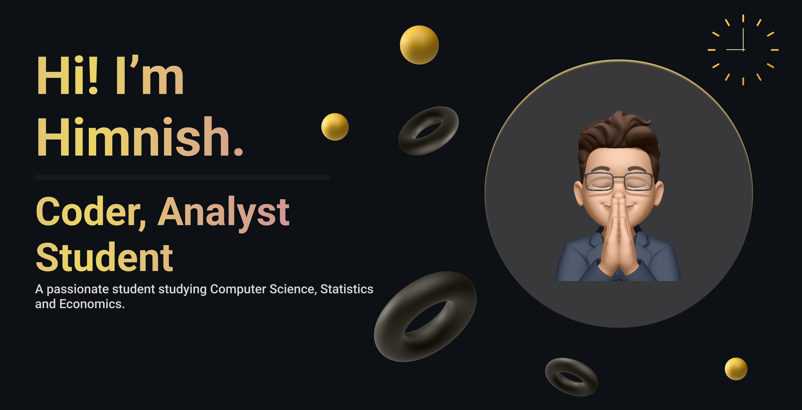

<!-- ### Hi there 👋 -->
<!--
**Himnish/Himnish** is a ✨ _special_ ✨ repository because its `README.md` (this file) appears on your GitHub profile.

Here are some ideas to get you started:

- 🔭 I’m currently working on ...
- 🌱 I’m currently learning ...
- 👯 I’m looking to collaborate on ...
- 🤔 I’m looking for help with ...
- 💬 Ask me about ...
- 📫 How to reach me: ...
- 😄 Pronouns: ...
- ⚡ Fun fact: ...
-->

<!--
<h1 align="center">Hi 👋, I'm Himnish Jain</h1>
<h3 align="center">A passionate student studying Computer Science, Statistics and Economics.</h3>
-->

  

<!--
- 🔭 I’m currently working on [Project Delta](https://github.com/Himnish/Project-Delta)

- 👨‍💻 All of my projects are available at [https://github.com/Himnish](https://github.com/Himnish)

- 💬 Ask me about **Python, C++, C#, Java, Unity, Flutter**

- 📫 How to reach me **himnish.jain06@gmail.com**

- 📄 Know about my experiences [https://himnish.github.io/resume/](https://himnish.github.io/resume/)

<h3 align="left">Connect with me:</h3>

<h3 align="left">Languages and Tools:</h3>

                              

-->

# 💫 About Me:
- 🔭 I’m currently working on [Project Delta](https://github.com/Himnish/Project-Delta)

- 👨‍💻 All of my projects are available at [https://github.com/Himnish](https://github.com/Himnish)

- 💬 Ask me about **Python, C++, C#, Java, Unity, Flutter**

- 📫 How to reach me **himnish.jain06@gmail.com**

- 📄 Know about my experiences [https://himnish.github.io/resume/](https://himnish.github.io/resume/)
 

## 🌐 Socials:
 

# 💻 Tech Stack:
                               	                

### ✍️ Random Dev Quote

## 🤖 Statistics

<!--

-->
